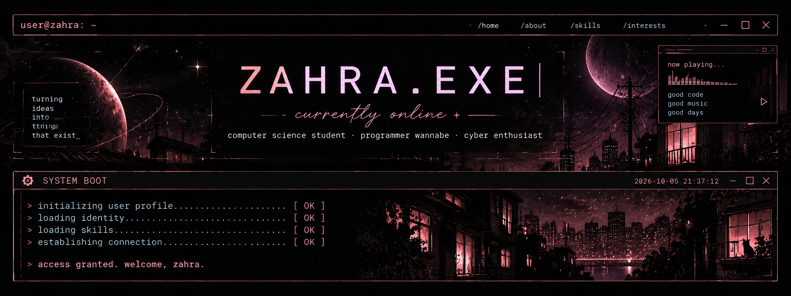
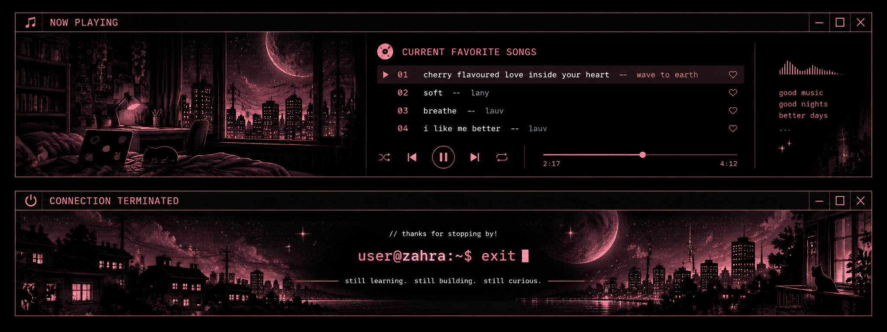

<div align="center">



</div>
---

## `> whoami`

```bash
$ whoami

zahra
```

```txt
user       : zahra
field      : Computer Science
univ       : Universitas Pendidikan Indonesia
location   : Bandung, Indonesia
status     : sleeping
```
---

## `> interests --list`

```txt
[01] web development
[02] it-bussiness
[03] cybersecurity
[04] software engineering
[05] problem solving
[06] piano & music
```

---

## `> tech --stack`

```text
┌─[ LANGUAGES ]
│
├── C
├── C++
├── Python
├── Java
├── PHP
└── JavaScript


┌─[ WEB ]
│
├── HTML / CSS
├── Next.js
└── Tailwind CSS
```

```text
SYSTEM STATUS

[████████████████░░░░] learning
[██████████████░░░░░░] building
[████████████░░░░░░░░] exploring
```

---

## `> sudo apt install curiosity`

```text
Reading package lists... Done
Building dependency tree... Done

The following packages will be installed:

    curiosity
    creativity
    persistence
    problem_solving
    caffeine

0 upgraded, 5 newly installed.
```

---

## `> connect`

<div align="center">



</div>
